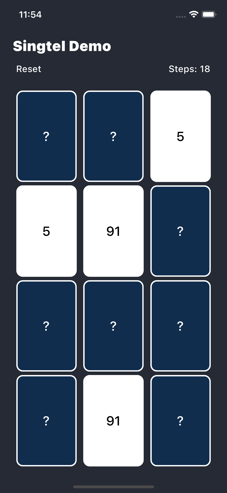

# SingtelDemo
Card Game

Based on:

- [React 17](https://reactjs.org)
- [React Native 0.65](https://reactnative.dev)
- [Redux](https://redux.js.org)

## Getting started

- Install [yarn](https://classic.yarnpkg.com/en/docs/install): `npm i -g yarn`
- Install dependencies: `yarn`
- iOS-specific:
  - update pod files `cd ios && pod update`
  - move back and run `npx react-native run-ios`

## Running

- IOS Simulator - `npx react-native run-ios`
- Android Simulator - `npx react-native run-android`

## Screen Shot

### Game view screen

- This image show the game
- reset button will reset your game.
- Once you complete the game dialog appear congratulating you.
- Try again will reset your step and randomise the game.

